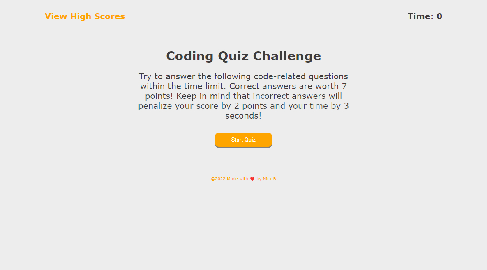

# Challenge 4: Javascript-Quiz-Time
 
 <h2>Site URL:</h2>
 https://nickus1028.github.io/Weather-Dashboard/
 
 <h2>Screenshot<h2>
 </img>
   
 <h2>Summary</h2>
   
  <ul>
    <li>Uses HTML, Javascript and CSS</li>
    <li>Dynamically created HTML elements to display questions</li>
    <li>Keep a high score that is saved in your browser</li>
   
